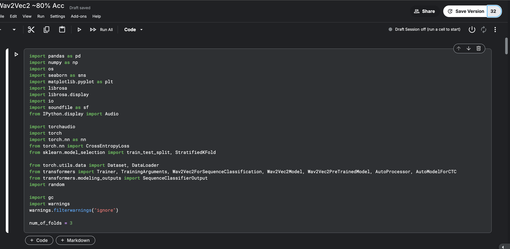
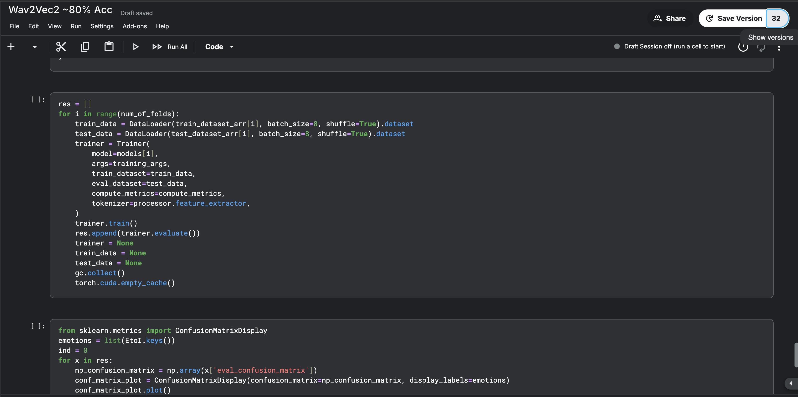
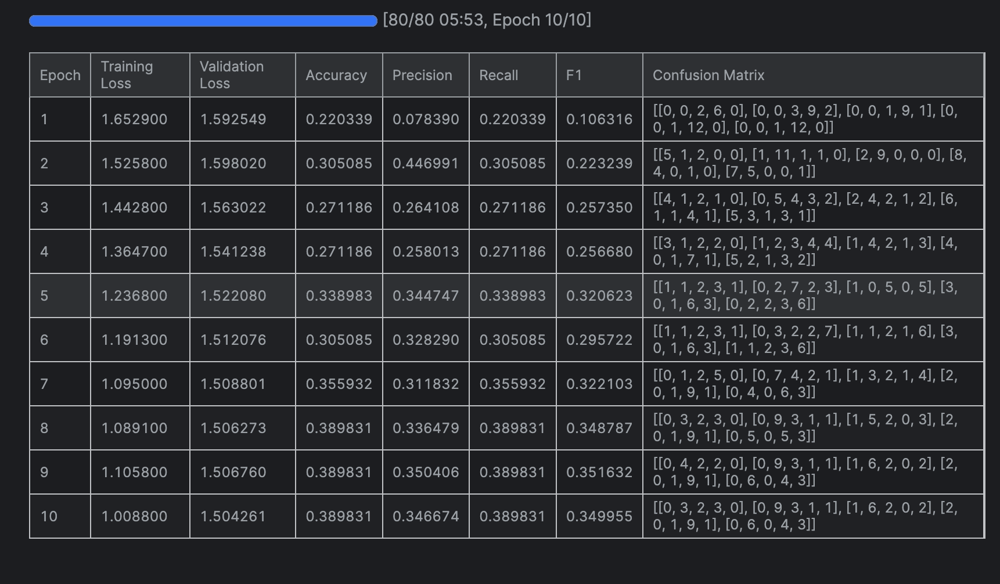
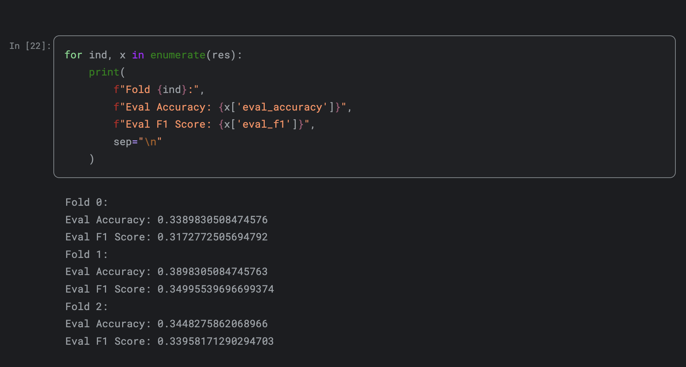
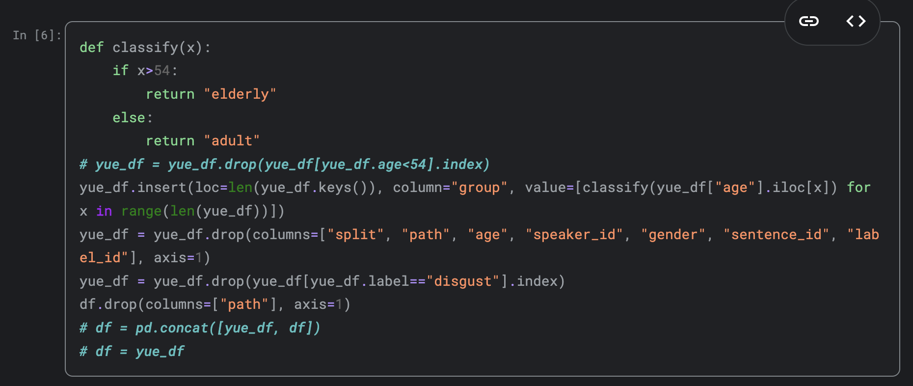
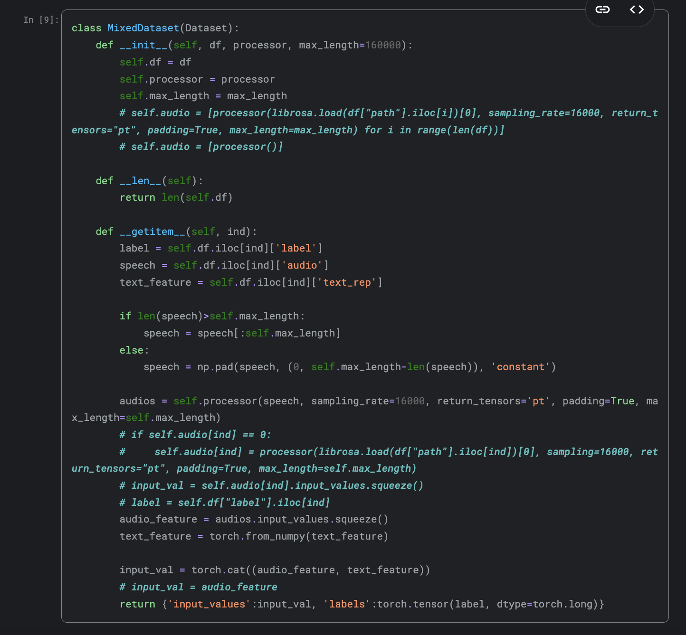

# How to use the dataset to train the models and output the accuracy of the model:

# Step 1
To make sure that all the packages in our project is correctly installed and to ensure that the environment is consistent. We recommend using Kaggle to open our jupyter notebook.  

To open the notebook in Kaggle, you can upload the fyp.ipynb to [Kaggle](https://www.kaggle.com/) or simply go to [our Kaggle notebook](https://www.kaggle.com/code/lincolnshl/wav2vec2-80-acc).

Click copy and edit if you went to our Kaggle notebook.
# Step 2
Now we can try to run the notebook that is forked from the latest save, which uses the original dataset and text-based features by clicking run all. It may take some time for the notebook to run, we recommend using GPU to run the notebook.


Press the run all button at the top. Then the code will run automatically, then scroll down untill you see this block of code:


The output of this code is the training results of the model. Outputted on every epoch end. It should look something like this:


Then scroll to the bottom of the notebook, after the training concludes, you can find information about the average accuracy of the model, along with accuracy and confusion matrix of each fold, ordered sequentially.


The final results would look somewhat like this.

# Step 3
So how to choose which dataset to use?

## Enable/Disable YueMotion
To enable/disable YueMotion, simply comment/uncomment the line that concatenates `df` and `yue_df`. Example:
### Enable
```
df = pd.concat([yue_df, df])
```
### Disable
```
# df = pd.concat([yue_df, df])
```
The block that contains the line is:


## Enable/Disable Text-Based Features
To enable/disable text-based features, simply comment/uncomment the line that concatenates `audio_feature` and `text_feature`. Example:
### Enable
```
input_val = torch.cat((audio_feature, text_feature))
```
### Disable
```
# input_val = torch.cat((audio_feature, text_feature))
```

The code block that contains the line is:


That's all you need to know to use the notebook!